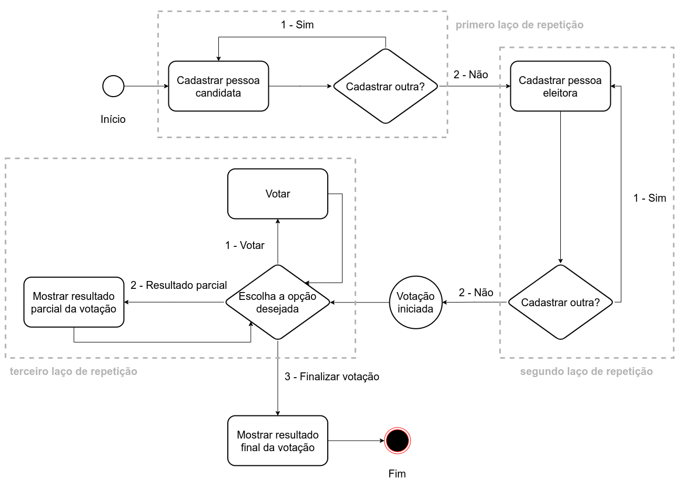

# Desafio: Sistema de Votação


Por conta de seus conhecimentos em Java, você recebeu uma demanda para desenvolver um sistema de votação eletrônico. A ideia é que esse sistema permita o cadastro das pessoas candidatas, o cadastro das pessoas eleitoras, a realização do processo de votação e a consulta do resultado tanto parcial quanto final da votação.

O fluxo do sistema é definido seguindo três etapas principais que devem ser executadas na seguinte ordem:

1. **Cadastrar pessoas candidatas:** nessa etapa, é preciso ter um menu para o cadastro de pessoas candidatas e, ao fim do cadastro de cada nova pessoa, deve-se oferecer a opção de cadastrar outra. Quando não houver mais pessoas candidatas para serem cadastradas, então se passa para a etapa de cadastro de pessoas eleitoras;

2. **Cadastrar pessoas eleitoras:** aqui é preciso ter um menu que possibilite o cadastro de pessoas eleitoras, similar ao menu do cadastro de pessoas candidatas. Finalizado o cadastro, deve-se voltar ao estado inicial do menu de cadastro de pessoas eleitoras para oferecer a oportunidade de cadastrar uma nova pessoa. Quando não houver mais pessoas eleitoras para serem cadastradas, o sistema deve seguir para a etapa de votação;

3. **Iniciar processo votação:** nessa etapa é iniciado o processo de votação, em que foi solicitado, na demanda, um menu que ofereça as opções de `votar`, `ver resultado parcial` e `finalizar a votação`. A seguir o detalhamento de cada caminho:
- Quando escolhida a opção `votar`, solicita-se o identificador da pessoa eleitora (por exemplo, o CPF) e o número da pessoa candidata em quem se deseja votar. Depois do voto, o menu deve voltar ao estado inicial, oferecendo as opções `votar`, `ver resultado parcial` e `finalizar a votação`.
- A opção `ver resultado parcial` deve listar todos os nomes das pessoas candidatas, mostrando a quantidade de votos absolutos recebida por cada pessoa candidata e o percentual de votos entre elas. Depois de ver o resultado parcial, o menu deve voltar ao estado inicial, oferecendo as opções `votar`, `ver resultado parcial` e `finalizar a votação`.
- A opção `finalizar a votação` deve mostrar o resultado da votação listando as pessoas candidatas, o número absoluto de votos por pessoa candidata e também o percentual dos votos totais que cada pessoa candidata recebeu. Com o fechamento do processo de votação, o programa deve ser finalizado.

A imagem a seguir representa o fluxo do sistema de forma gráfica.


Esse sistema deve ter cinco classes: `Principal`, `GerenciamentoVotacao`, `Pessoa`, `PessoaCandidata` e `PessoaEleitora`. Cada uma delas é descrita a seguir:

- `Principal`: essa classe deve conter o método `main`, que por sua vez deve conter (I) uma instância da classe `GerenciamentoVotacao`, (II) uma instância da classe `Scanner` para poder ler as entradas da pessoa usuária pelo console e (III) três laços de repetição que representam menus da aplicação. O primeiro laço deve conter o menu para o cadastro de pessoas candidatas, o segundo deve conter o menu para o cadastro de pessoas eleitoras, e o terceiro, o menu para votar, ver o resultado parcial e finalizar a votação.
   - O menu do primeiro laço deve ter o formato:
   
```
        Cadastrar pessoa candidata?
        1 - Sim
        2 - Não
        Entre com o número correspondente à opção desejada:
```

   Se a pessoa usuária entrar com o valor 1 (que indica que ela quer cadastrar uma pessoa candidata), a mensagem `Entre com o nome da pessoa candidata:` deverá ser impressa no console. Em seguida, depois de inserir o nome da pessoa candidata e pressionar enter, aparecerá a mensagem `Entre com o número da pessoa candidata:` no console. Depois que a pessoa usuária inserir o número da pessoa candidata, o sistema deverá retornar ao estado inicial do menu. Supondo que o nome da primeira pessoa candidata seja "Maria" e o seu número para votar seja "1", então um exemplo do conteúdo do console depois de cadastrar a primeira pessoa candidata será:
   
```
        Cadastrar pessoa candidata?
        1 - Sim
        2 - Não
        Entre com o número correspondente à opção desejada:
        1
        Entre com o nome da pessoa candidata:
        Maria
        Entre com o número da pessoa candidata:
        1
        Cadastrar pessoa candidata?
        1 - Sim
        2 - Não
        Entre com o número correspondente à opção desejada:
```
        
   Esse ciclo se repete até não haver mais pessoas candidatas para serem cadastradas. Quando isso acontencer, a pessoa usuária entrará com a opção 2 do menu, o que vai parar o primeiro laço. O segundo laço, que representa a etapa de cadastro de pessoas eleitoras, deve ser iniciado logo na sequência.

   - O menu do segundo laço deve ter o formato:
   ```
        Cadastrar pessoa eleitora?
        1 - Sim
        2 - Não
        Entre com o número correspondente à opção desejada:
   ```
        
   Se a pessoa usuária entrar com o valor 1 (que indica que ela quer cadastrar uma pessoa eleitora), então a mensagem `Entre com o nome da pessoa eleitora:` será impressa no console. Em seguida, depois de inserir o nome da pessoa eleitora e pressionar enter, aparecerá no console a mensagem `Entre com o cpf da pessoa eleitora:`. Depois que a pessoa usuária inserir o CPF da pessoa eleitora, o sistema deve retornar ao estado inicial do menu. Supondo que o nome da primeira pessoa eleitora seja Joao, portador do CPF 978.413.510-89, um exemplo do conteúdo do console depois de cadastrá-la será:
   
```
        Cadastrar pessoa eleitora?
        1 - Sim
        2 - Não
        Entre com o número correspondente à opção desejada:
        1
        Entre com o nome da pessoa eleitora:
        João
        Entre com o cpf da pessoa eleitora:
        978.413.510-89
        Cadastrar pessoa eleitora?
        1 - Sim
        2 - Não
        Entre com o número correspondente à opção desejada:
 ```
        
   Esse ciclo se repete até o esgotamento das pessoas eleitoras a serem cadastradas. Ao final desse cadastro, a pessoa usuária entrará com a opção 2 do menu, o que vai parar o segundo laço e iniciar o terceiro, marcando o início da votação.

   - O menu do terceiro laço deve ter o seguinte formato:
   
```
     Entre com o número correspondente à opção desejada:
     1 - Votar
     2 - Resultado Parcial
     3 - Finalizar Votação
```
        
   Se a pessoa usuária entrar com o valor 1 (que indica que ela quer computar um voto), a mensagem `Entre com o cpf da pessoa eleitora:` deverá ser impressa no console. Em seguida, depois de inserir o CPF da pessoa eleitora e pressionar enter, aparecerá a mensagem `Entre com o número da pessoa candidata:` no console. Feito isso, o voto deve ser computado, e o sistema retorna ao estado inicial do menu. Supondo que o CPF da primeira pessoa eleitora seja 978.413.510-89, e o número da pessoa candidata seja 1, então um exemplo do conteúdo do console depois de realizar um voto será:
   
```
     Entre com o número correspondente à opção desejada:
     1 - Votar
     2 - Resultado Parcial
     3 - Finalizar Votação
     1
     Entre com o cpf da pessoa eleitora:
     978.413.510-89
     Entre com o número da pessoa candidata:
     1
     Entre com o número correspondente à opção desejada:
     1 - Votar
     2 - Resultado Parcial
     3 - Finalizar Votação
```

  Por outro lado, se a pessoa usuária entrar com o valor 2 (que indica que ela quer visualizar o resultado parcial), deve ser impresso no console o resultado parcial. Supondo que temos apenas a pessoa candidata Maria e a pessoa eleitora João, e que João votou em Maria, um exemplo do conteúdo do console depois de escolher a opção 2 (Resultado Parcial) será:
        
```
     Entre com o número correspondente à opção desejada:
     1 - Votar
     2 - Resultado Parcial
     3 - Finalizar Votação
     2
     Nome: Maria - 1 votos ( 100.0% )
     Total de votos: 1
     Entre com o número correspondente à opção desejada:
     1 - Votar
     2 - Resultado Parcial
     3 - Finalizar Votação
```       
        
  Esse ciclo se repete até que a pessoa usuária escolha a opção 3 (Finalizar Votação). Quando a opção 3 for escolhida, o terceiro laço deve ser terminado, imprimindo o resultado da votação, de forma similar ao resultado parcial, seguida da finalização do programa.
        
  Supondo que temos apenas a pessoa candidata Maria e a pessoa eleitora João, e que João votou em Maria, um exemplo do conteúdo do console depois de selecionada a opção 3 (Finalizar Votação) será:
        
```
        Entre com o número correspondente à opção desejada:
        1 - Votar
        2 - Resultado Parcial
        3 - Finalizar Votação
        3
        Nome: Maria - 1 votos ( 100.0% )
        Total de votos: 1
```
        
A figura a seguir evidencia os laços de repetição:
        


- `GerenciamentoVotacao`: essa classe é responsável por gerenciar a votação e o cadastro de pessoas candidatas e pessoas eleitoras. A classe `Principal` deve instanciar um objeto da classe `GerenciamentoVotacao` para lidar com todo o processo de votação e cadastro. Ela terá quatro atributos privados:
    
- `pessoasCandidatas`: esse atributo é um array dinâmico de objetos da classe `PessoaCandidata` e, para facilitar sua manipulação, ele deve ser uma instância da classe `ArrayList`. Para mais informações, você pode consultar o site da [W3Schools]](https://www.w3schools.com/java/java_arraylist.asp), ou [JavaPoint](https://www.javatpoint.com/java-arraylist), ou ainda verificar a documentação da Oracle. Esse array é responsável por manter em uma lista as pessoas candidatas cadastradas, ou seja, os objetos instanciados da classe `PessoaCandidata`.

- `pessoasEleitoras`: esse atributo é um array dinâmico de objetos da classe `PessoaEleitora` e, para facilitar sua manipulação, ele deve ser uma instância da classe `ArrayList`. Para mais informações, você pode consultar o site da [W3Schools]](https://www.w3schools.com/java/java_arraylist.asp), ou [JavaPoint](https://www.javatpoint.com/java-arraylist), ou ainda verificar a documentação da Oracle. Esse array é responsável por manter em uma lista as pessoas eleitoras cadastradas, ou seja, os objetos instanciados da classe `PessoaEleitora`.

- `cpfComputado`: esse atributo é um array dinâmico de Strings e, para facilitar sua manipulação, ele deve ser uma instância da classe `ArrayList`. Para mais informações, você pode consultar o site da [W3Schools]](https://www.w3schools.com/java/java_arraylist.asp), ou [JavaPoint](https://www.javatpoint.com/java-arraylist), ou ainda verificar a documentação da Oracle. Esse array é responsável por manter os CPFs das pessoas eleitoras que já votaram em uma lista de Strings, de forma que possamos verificar se a pessoa eleitora já votou. Lembre-se de que cada pessoa eleitora só pode votar uma única vez.

- `totalVotos`: esse atributo do tipo inteiro é responsável por contar a quantidade de votos que foram realizados, de forma que possa ser usado ao final para computar o percentual de votos recebidos por cada pessoa candidata e também para mostrar a quantidade total de votos já computados.

  Essa classe também deve conter pelo menos cinco métodos, em que quatro são públicos e um privado. Eles são:

- `cadastrarPessoaCandidata`: esse método público deve receber dois parâmetros: o `nome` e o `numero` da pessoa candidata. O parâmetro `nome` é do tipo String e o parâmetro `numero` é do tipo inteiro. Esse método deve verificar se o número da pessoa candidata já está cadastrado e, caso esteja, deve imprimir a mensagem `Número pessoa candidata já utilizado!` no console. Caso contrário, deve instanciar um objeto da classe `PessoaCandidata` passando os parâmetros `nome` e `numero` para o construtor da classe `PessoaCandidata`. Por fim, adicione esse novo objeto instanciado no array `pessoasCandidatas` (Dica: utilize o método `.add` da classe `ArrayList`). Esse método deve ter o retorno do tipo `void`.
    
- `cadastrarPessoaEleitora`: esse método público deve receber dois parâmetros do tipo String: o `nome` e o `cpf` da pessoa eleitora. Esse método deve verificar se o CPF da pessoa eleitora já está cadastrado e, caso esteja, deve imprimir a mensagem `Pessoa eleitora já cadastrada!` no console. Caso contrário, deve instanciar um objeto da classe `PessoaEleitora` passando os parâmetros `nome` e `cpf` para o construtor da classe `PessoaEleitora`. Por fim, adicione esse novo objeto instanciado no array `pessoasEleitoras` (Dica: utilize o método `.add` da classe `ArrayList`). Esse método deve ter o retorno do tipo `void`.

- `votar`: esse método público deve receber dois parâmetros: o `cpfPessoaEleitora` e o `numeroPessoaCandidata`. O parâmetro `cpfPessoaEleitora` é do tipo String, e o parâmetro `numeroPessoaCandidata` do tipo inteiro. Esse método deve verificar se o CPF da pessoa eleitora já está inserido no array `cpfComputado` e, caso esteja, deve imprimir a mensagem `Pessoa eleitora já votou!` no console. Caso contrário, deve percorrer o array `pessoasCandidatas` para encontrar o objeto da pessoa candidata que tenha o número passado pelo parâmetro `numeroPessoaCandidata`. Quando encontrar o objeto que representa a pessoa candidata, deverá chamar o método `receberVoto` do objeto da classe `PessoaCandidata`. Por fim, deve inserir o CPF da pessoa eleitora no array `cpfComputado`, de forma que essa pessoa eleitora não possa votar novamente (Dica: utilize o método `.add` da classe `ArrayList`). Esse método deve ter o retorno do tipo `void`.

- `mostrarResultado`: esse método público é responsável por imprimir no console o resultado da eleição, seja parcial ou final. Ele tem o retorno do tipo `void` e não recebe nenhum parâmetro. Esse método, primeiramente, deve verificar se já existe algum voto computado e, caso não, imprime a mensagem `É preciso ter pelo menos um voto para mostrar o resultado.` no console. Caso já tenha votos computados, ele deve imprimir no console os nomes das pessoas candidatas com a quantidade de votos que elas receberam e o percentual de votos recebidos, bem como o total de votos computados.
    
  Suponha que temos duas pessoas candidatas: Maria e José. Maria recebeu 2 votos e José recebeu 1 voto. Veja como deve ser essa saída:
        
```
     Nome: Maria - 2 votos ( 67.0% )
     Nome: José - 1 votos ( 33.0% )
     Total de votos: 3
```
   
- `calcularPorcentagemVotos`: esse método privado serve para uso exclusivo dessa classe. Ele é utilizado para auxiliar no cálculo da porcentagem dos votos. Ele tem o retorno do tipo `double` e recebe um **parâmetro**. Esse parâmetro é um inteiro que representa o índice **do** objeto da classe `PessoaCandidata` no array `pessoasCandidatas`, de forma que se possa recuperar o número de votos recebidos por essa pessoa e **dividir** esse valor pelo total de votos computados que está armazenado no atributo `totalVotos`. Como o atributo `totalVotos` e o número de votos da pessoa candidata são do tipo inteiro, deve-se converter esses valores no tipo `float` ou `double`. Para **arredondar** o valor para uma casa decimal, utilize o método estático `round` da classe `Math` do Java.

- `Pessoa`: essa classe abstrata possui apenas o atributo protegido `nome` do tipo String. Ela tem também as assinaturas do método `Getter` e `Setter` para obrigar que a pessoa desenvolvedora faça a sua implementação nas classes herdeiras.

- `PessoaCandidata`: essa classe herda da classe `Pessoa`, ficando responsável por representar a pessoa candidata. Ela também é composta por dois atributos privados e do tipo inteiro, `numero` e `votos`, sendo o atributo `nome` herdado da classe `Pessoa`. Seu construtor recebe dois parâmetros, o `nome` e o `numero`, e os armazena nos respectivos atributos. O método construtor também inicializa o atributo `votos` com o valor zero. Essa classe é formada pelos métodos `Getter`s e `Setter`s dos atributos `nome`, `numero` e `votos`, contendo também um método `receberVoto` que adiciona 1 ao atributo voto toda vez que é chamado. 

Resumindo, a classe `PessoaCandidata` é formada por:

   - `nome`: atributo herdado da classe `Pessoa`;

   - `numero`: atributo do tipo inteiro que armazena o número identificador para voto;

   - `votos`: atributo do tipo inteiro que armazena o número de votos recebidos pela pessoa candidata.

   Os métodos dessa classe são:

   - `getNome`: método `Getter` para o atributo `nome`;

   - `setNome`: método `Setter` para o atributo `nome`;

   - `getNumero`: método `Getter` para o atributo `numero`;

   - `setNumero`: método `Setter` para o atributo `numero`;

   - `getVotos`: método `Getter` para o atributo `votos`;

   - `setVotos`: método `Setter` para o atributo `votos`;

   - `receberVoto`: método responsável por adicionar 1 ao atributo `votos` para representar a quantidade de votos recebidos pela pessoa candidata, esse método tem retorno do tipo `void`.

   Note que todos os métodos da classe em questão são públicos.

- `PessoaEleitora`: essa classe herda da classe `Pessoa`, ficando responsável por representar a pessoa eleitora. Ela também é composta por um atributo privado do tipo String, `cpf` e o atributo `nome` é herdado da classe `Pessoa`. Seu construtor recebe dois parâmetros, o `nome` e  o `cpf`, armazenando-os nos respectivos atributos. Essa classe também é formada pelos métodos `Getter`s e `Setter`s dos atributos `nome` e `cpf`.

Resumindo, a classe `PessoaEleitora` é formada por:

   - `nome`: atributo herdado da classe `Pessoa`;

   - `cpf`: atributo do tipo String que armazena o CPF da pessoa eleitora;

   Os métodos dessa classe são:

   - `getNome`: método `Getter` para o atributo `nome`;

   - `setNome`: método `Setter` para o atributo `nome`;

   - `getCpf`: método `Getter` para o atributo `cpf`;

   - `setCpf`: método `Setter` para o atributo `cpf`;

   Note que todos os métodos dessa classe são públicos.

## Restrições

- Pessoa candidata só pode ser cadastrada uma vez.
- Pessoa eleitora só pode ser cadastrada uma vez.
- Nome da pessoa candidata e eleitora só pode ser o primeiro nome para facilitar o uso da classe `Scanner` do Java.
- Pessoa eleitora só pode votar uma vez.

## Exemplo

Aqui tempos um exemplo do funcionamento desse sistema, considerando a saída completa do console. Nesse exemplo, temos duas pessoas candidatas, Maria e José, e três pessoas eleitoras, João, Rute e Raquel. Supondo que João e Rute votaram em Maria e que Raquel votou em José, teremos a seguinte saída:

```
----------- Bem-vindo ao Sistema de Votação -----------

Cadastrar pessoa candidata?
1 - Sim
2 - Não
Entre com o número correspondente à opção desejada:
1
Entre com o nome da pessoa candidata:
Maria
Entre com o número da pessoa candidata:
1
Cadastrar pessoa candidata?
1 - Sim
2 - Não
Entre com o número correspondente à opção desejada:
1
Entre com o nome da pessoa candidata:
José
Entre com o número da pessoa candidata:
2
Cadastrar pessoa candidata?
1 - Sim
2 - Não
Entre com o número correspondente à opção desejada:
2


----------- Cadastre as pessoas eleitoras -----------

Cadastrar pessoa eleitora?
1 - Sim
2 - Não
Entre com o número correspondente à opção desejada:
1
Entre com o nome da pessoa eleitora:
João
Entre com o cpf da pessoa eleitora:
154.118.560-94
Cadastrar pessoa eleitora?
1 - Sim
2 - Não
Entre com o número correspondente à opção desejada:
1
Entre com o nome da pessoa eleitora:
Rute
Entre com o cpf da pessoa eleitora:
589.292.640-00
Cadastrar pessoa eleitora?
1 - Sim
2 - Não
Entre com o número correspondente à opção desejada:
1
Entre com o nome da pessoa eleitora:
Raquel
Entre com o cpf da pessoa eleitora:
023.476.580-18
Cadastrar pessoa eleitora?
1 - Sim
2 - Não
Entre com o número correspondente à opção desejada:
2


----------- Votação iniciada! -----------

Entre com o número correspondente à opção desejada:
1 - Votar
2 - Resultado Parcial
3 - Finalizar Votação
1
Entre com o cpf da pessoa eleitora:
154.118.560-94
Entre com o número da pessoa candidata:
1
Entre com o número correspondente à opção desejada:
1 - Votar
2 - Resultado Parcial
3 - Finalizar Votação
1
Entre com o cpf da pessoa eleitora:
589.292.640-00
Entre com o número da pessoa candidata:
1
Entre com o número correspondente à opção desejada:
1 - Votar
2 - Resultado Parcial
3 - Finalizar Votação
1
Entre com o cpf da pessoa eleitora:
023.476.580-18
Entre com o número da pessoa candidata:
2
Entre com o número correspondente à opção desejada:
1 - Votar
2 - Resultado Parcial
3 - Finalizar Votação
3
Nome: Maria - 2 votos ( 67.0% )
Nome: José - 1 votos ( 33.0% )
Total de votos: 3
```
